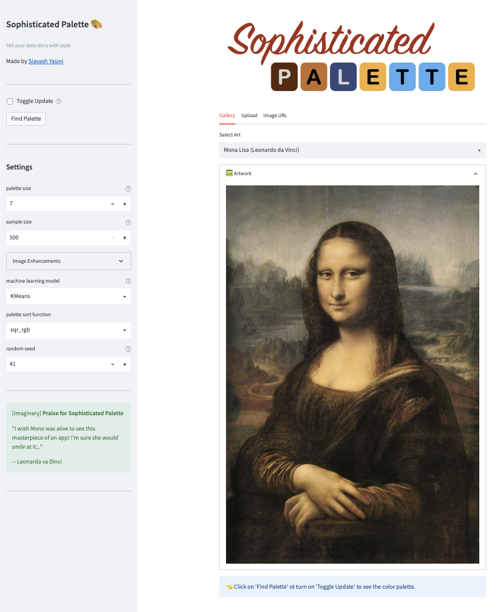
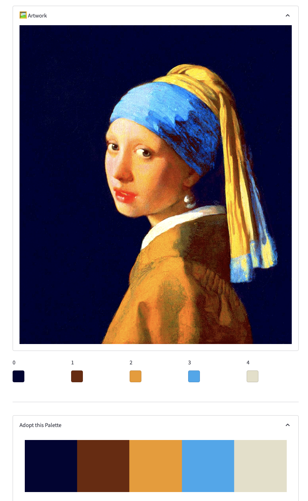
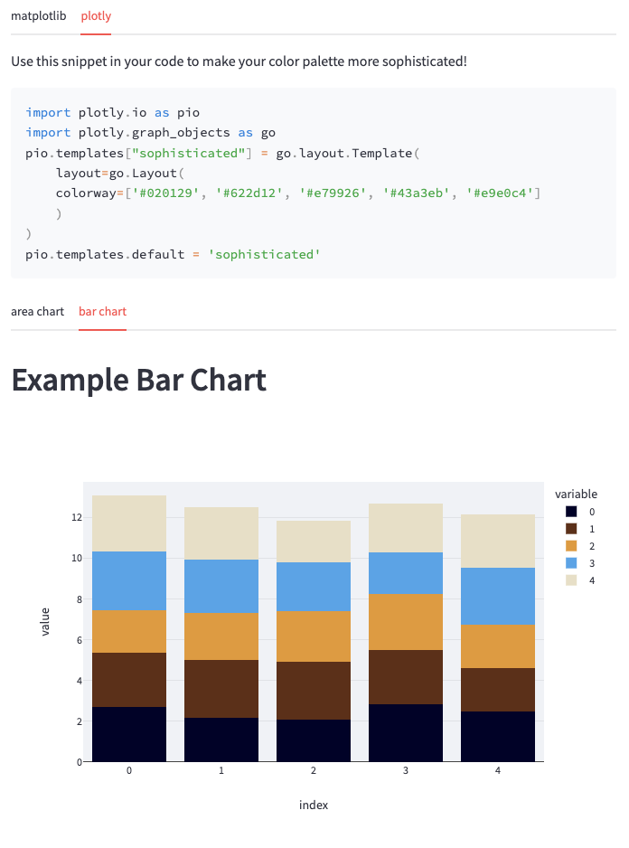

# [Sophisticated Palette](https://syasini-sophisticated-palette-app-dkc725.streamlitapp.com/)

A [Streamlit](https://streamlit.io/) 🎈 web app to help you tell your data story in style!

Use the code snippets to adopt the color palette and port it to matplotlib

or plotly

